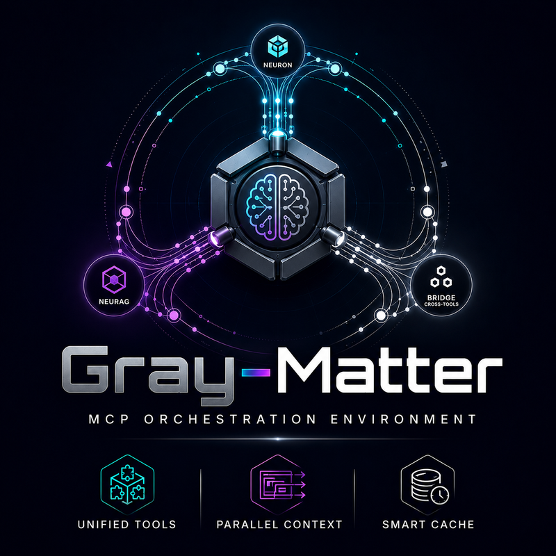

# Gray Matter Environment

<div align="center">

<br>
<a href="https://github.com/recla93/GrayMatterEnvironment/actions/workflows/ci.yml"></a>
<a href="https://github.com/recla93/GrayMatterEnvironment/actions/workflows/standalone.yml"></a>


</div>

Three cooperating MCP projects, one memory ecosystem for AI agents.

**This is the umbrella repo — the whole suite in one tree.** The three projects
also live on their own, and you can install any of them from there. What you
cannot do is develop them there: see [Where the code lives](#where-the-code-lives).

---

## What is Gray Matter?

Gray Matter is a **Model Context Protocol (MCP)** ecosystem that gives AI agents
**persistent memory** across conversations. It combines three complementary components:

| Component | Version | Role | Learns? |
|---|---|---|---|
| [**Neuron**](neuron/) | [](neuron/) | Episodic/conceptual semantic memory — graph, salience, trust, decay | Yes |
| [**NeuRAG**](neurag/) | [](neurag/) | Hierarchical knowledge base — nodes, chunks, triggers, auto-ingest | No — permanent vault |
| [**Gray Matter**](gray_matter/) | [](gray_matter/) | Gateway/orchestrator — routes, caches, bridges, GUI | Bridges only |

**Model:** MCP clients register ONLY `gray-matter` (the gateway). Neuron and
NeuRAG run as GM-managed workers. Each can also run standalone.

---

## Where the code lives

Four repositories, one source of truth.

| Repo | What it is | Write to it? |
|---|---|---|
| **GrayMatterEnvironment** (here) | The suite: the three projects, the docs, the pipelines | **Yes — this is where you commit** |
| [Neuron](https://github.com/recla93/Neuron) | Neuron alone, installable on its own | No — projection |
| [NeuRAG](https://github.com/recla93/NeuRAG) | NeuRAG alone, installable on its own | No — projection |
| [gray-matter](https://github.com/recla93/gray-matter) | The gateway alone | No — projection |

The three are not copies kept in step by hand: `git subtree split` extracts each
folder from this tree as its own history and pushes it there — a plain
fast-forward, same commits, same SHAs, same tags. A commit that touches two
projects splits itself, and only the relevant half reaches each one.

**So: install from wherever you like, but open pull requests here.** The three
mirrors run no CI of their own and their `main` accepts nothing but the mirror
job — a PR opened there would sit unbuilt.

Why an umbrella and not "Gray Matter with the others inside": Neuron and NeuRAG
must work with no gateway present, and a gateway that contains them makes that
contract impossible to keep honest. `standalone.yml` installs each peer alone,
in a venv where importing `gray_matter` is an error, and imports every product
module one by one. That job is the contract.

---

## Quickstart

> **Just installed?** Read **[GuidedUse.md](GuidedUse.md)** — it is the guide for
> the half hour after the install, written for someone who wants to know what to
> actually *do*.

### Option A — One-click installer (recommended)

Every project carries its own click-and-go installer, **inside its folder** —
there is no installer at the workspace root. Whichever one you start from, you
end up with the same result: Python bootstrapped if missing, one shared venv,
the gateway registered in your MCP clients, hooks deployed, and a **Gray Matter
GUI** shortcut on the Desktop.

| Platform | Action |
|---|---|
| **Windows** | Double-click **`gray_matter\install.cmd`** (or `.\install.ps1` from a terminal) |
| **macOS** | Double-click **`gray_matter/install.command`** (or `sh install.sh` from a terminal) |
| **Linux** | `sh gray_matter/install.sh` from a terminal |

Start from `gray_matter/` to get the whole suite: its installer picks up
`neuron/` and `neurag/` sitting next to it and installs all three into one venv.
If either is missing it says so and installs the gateway alone — Gray Matter
runs fine on its own, just with that half of the memory absent.

No Python? The installer bootstraps it (winget on Windows, brew/apt on Linux/macOS).
Pre-built `pyturso` wheels are bundled — no C/Rust compiler needed.

### Option B — Starting from one project

Each project is also a standalone repo with the same installer:

| You start from | Double-click | You get |
|---|---|---|
| **gray_matter** | `install.cmd` / `install.command` | GM + whichever of Neuron/NeuRAG sit beside it |
| **neuron** | `install.cmd` / `install.command` | Mode selector → Full suite or Solo Neuron |
| **neurag** | `install.cmd` / `install.command` | Mode selector → Full suite or Solo NeuRAG |

Neuron and NeuRAG bootstrap Gray Matter themselves when it isn't already there,
so the gateway is never the piece you have to remember to install. Every path:
Python bootstrapped if missing, **mode selector** (Enter = Full suite), one
shared venv, gateway registered, hooks deployed.

### Option C — pip (source checkout)

```bash
git clone https://github.com/recla93/GrayMatterEnvironment.git
cd GrayMatterEnvironment

# Install all three:
pip install -e gray_matter -e neuron -e neurag

# Or individually:
pip install -e neuron -e neuron"[dev]"          # Neuron only
pip install -e neurag -e neurag"[semantic,cloud]" # NeuRAG only
pip install -e gray_matter -e gray_matter"[dev,cloud,rag,gui]" # Gray Matter only
```

### Verify

```bash
gray-matter doctor    # health snapshot: servers, workers, cache, bridges
gray-matter status    # registered servers with tool lists
gray-matter stats     # cache hit rate, flashes, bridges, latency
```

---

## How it works

```
┌─────────────────────────────────────────────────────────────────────┐
│                        Your AI Client                               │
│  (Claude Desktop, Cursor, OpenCode, Gemini CLI, Windsurf, etc.)    │
│                                                                     │
│  Calls: gray_matter_pulse(topic)                                    │
│  Or:    neuron_store_turn / knowledge_query / etc. (pass-through)   │
└─────────────────────────────┬───────────────────────────────────────┘
                              │ stdio / HTTP
                              ▼
┌─────────────────────────────────────────────────────────────────────┐
│                    Gray Matter (Gateway)                             │
│                                                                     │
│  gray_matter_pulse(topic):                                          │
│    1. Check context cache (TTL + LRU)                               │
│    2. Call Neuron get_context (memory) + NeuRAG knowledge_query     │
│    3. Merge + inject context                                        │
│    4. Optionally trigger semantic flash (lateral associations)      │
│    5. Persist bridge (Neuron ↔ NeuRAG connections)                 │
│                                                                     │
│  Also: pass-through for all Neuron + NeuRAG tools                   │
└───────────────┬─────────────────────────────┬───────────────────────┘
                │ managed worker              │ managed worker
                ▼                             ▼
┌───────────────────────┐       ┌───────────────────────────────────┐
│       Neuron          │       │           NeuRAG                  │
│                       │       │                                   │
│  Episodic memory:     │       │  Knowledge base:                  │
│  • 384-dim vectors    │       │  • Hierarchical nodes             │
│  • Salience + decay   │◄─────►│  • AST-aware chunking             │
│  • Hebbian bridges    │       │  • Auto-ingest pipeline           │
│  • Semantic flashes   │       │  • Turso auto-provision           │
│                       │       │  • Cross-linking                  │
└───────────────────────┘       └───────────────────────────────────┘
        │                               │
        └───────────┬───────────────────┘
                    ▼
            ┌───────────────┐
            │  Turso (SQL)  │
            │  Native vectors│
            │  sqlite3 fallback│
            └───────────────┘
```

---

## Key features

### For users
- **One-click install** — no Python knowledge required
- **Gray Matter GUI** — wizard, Install/Repair, Test, Preferences, Turso, Folders
- **Persistent memory** — your AI remembers across conversations
- **Zero config** — Turso database auto-provisioned, defaults tuned for speed

### For developers
- **Modular architecture** — use one, two, or all three components
- **MCP protocol** — standard interface for AI clients
- **Rich CLI** — 25+ commands for management, diagnostics, and repair
- **Self-checks** — deterministic tests without model downloads
- **Cross-platform** — Windows, macOS, Linux with platform-specific bootstrapping

---

## Projects in depth

### [Neuron](neuron/) — Semantic Memory

Neuron is the **living memory** of the system. It tracks what you discuss, builds
a semantic graph, and injects the most relevant connections before each response.

- **384-dim vector embeddings** (FastEmbed/BERT) for semantic search
- **Salience + trust** — frequent, trusted concepts surface more often
- **Decay** — forgotten topics fade naturally
- **Semantic flashes** — lateral associations that simulate analogical thinking
- **Hebbian bridges** — connections that strengthen when used together
- **Shared embeddings** with NeuRAG for cross-store bridges

### [NeuRAG](neurag/) — Knowledge Base

NeuRAG is the **permanent vault**. Unlike Neuron, facts never decay — it's a
reference library, not a living memory.

- **Hierarchical structure** — godnode → fundamental → specialization → chunks
- **AST-aware chunking** — understands code structure (Python, Kotlin, Java, TS/JS)
- **Auto-ingest** — scan a folder, auto-create nodes, chunk, embed, link
- **Turso auto-provision** — installs pyturso from bundled wheels if missing
- **Cross-linking** — tag-based and source-based links enrich search results
- **Cloud support** — separate Turso Cloud database via `NEURAG_TURSO_*` env vars

### [Gray Matter](gray_matter/) — Gateway/Orchestrator

Gray Matter is the **brain** that ties everything together. Clients see only GM;
it manages Neuron and NeuRAG as internal workers.

- **Unified pulse** — `gray_matter_pulse(topic)` merges memory + knowledge + flash
- **Context cache** — TTL + LRU with targeted invalidation
- **Cross-store bridges** — connects Neuron concepts to NeuRAG knowledge
- **Gateway model** — one entry point, evicts standalone registrations
- **GUI control center** — web-based wizard with Install/Repair/Test/Prefs
- **CLI** — 25+ commands for every operation

---

## Documentation

### Suite-level
| Doc | What's in it |
|---|---|
| **[ARCHITETTURA.md](ARCHITETTURA.md)** | Architecture deep dive (NeuRAG + Gray Matter) |
| **[INSTALLER-UX.md](INSTALLER-UX.md)** | Full installer/uninstaller spec (SSOT) |
| **[GRAY-MATTER-COMPENDIUM.md](GRAY-MATTER-COMPENDIUM.md)** | Bugs, fixes, roadmap, status |
| **[ENVIRONMENT.md](ENVIRONMENT.md)** | Dev environment rules |

### User docs
| Where | What's in it |
|---|---|
| **[GuidedUse.md](GuidedUse.md)** | **Start here after installing.** "Wow, I've got a brain: now what?" — the first half hour: what you have, memory vs knowledge, feeding it, teaching it, and what it deliberately will not do |
| **[docs/](docs/)** | Getting started, CLI, tools, configuration, data, troubleshooting — every page in English and Italian (`*.it.md`) |

### Working material
Audits, plans, design records and past handoffs live in **[work/](work/)** —
kept apart from the docs above because they describe a *moment*, not the current
state. Newest first in [work/history/](work/history/). See
[work/README.md](work/README.md) for what belongs where.

### Per-project
| Project | Docs |
|---|---|
| **Neuron** | [README](neuron/README.md) • [INSTALL-AI.md](neuron/INSTALL-AI.md) • [DOCTOOLUPDATE.md](neuron/DOCTOOLUPDATE.md) • [INSTALL.md](neuron/INSTALL.md) |
| **NeuRAG** | [README](neurag/README.md) • [INSTALL-AI.md](neurag/INSTALL-AI.md) • [DOCTOOLUPDATE.md](neurag/DOCTOOLUPDATE.md) • [DESIGN-CROSSLINKS.md](neurag/DESIGN-CROSSLINKS.md) |
| **Gray Matter** | [README](gray_matter/README.md) • [INSTALL-AI.md](gray_matter/INSTALL-AI.md) • [DOCTOOLUPDATE.md](gray_matter/DOCTOOLUPDATE.md) |

---

## Development

```bash
# Run all tests — one suite per process, and that is NOT optional:
# neuron/tests injects fake mcp/fastembed modules into sys.modules at import
# time, and neurag.db reads TURSO_AVAILABLE at ITS import time. Sharing one
# process leaks the fakes across repos (~25 spurious failures). See pytest.ini.
python -m pytest neuron/tests -q
python -m pytest gray_matter/tests -q
python -m pytest neurag/tests -q

# Isolated store for experiments
NEURON_NO_DOTENV=1 NS_GRAPHS_DIR=/tmp/neuron-test

# Self-checks (no install needed)
python neurag/selfcheck.py           # NeuRAG deterministics
python gray_matter/selfcheck.py      # Gray Matter deterministics
```

### The flow

1. Branch here, one branch for the whole change even when it spans two projects.
2. `ci.yml` runs the three suites, one job per project — separate processes, for
   the reason in `pytest.ini`. `standalone.yml` runs each peer without the
   gateway.
3. Merge into `main`. `mirror.yml` splits the tree and fast-forwards the three
   public repos.
4. Release by tagging **here**, with the project prefix: `neuron-v6.4.3`,
   `neurag-v1.3.4`, `gm-v1.4.2`. A bare `v*` would fire all three at once. The
   mirror renames the tag on the way out, so `neuron-v6.4.3` lands on Neuron as
   `v6.4.3` — which is what that repo's Releases page should say.

A version bump touches five files per project: `pyproject.toml`, `__init__.py`,
the README badge, `CHANGELOG.md`, and the vendored Gray Matter wheel in the
peers (`_gm_vendor/`) — plus `GM_VERSION` in the peers' installers, which the
release workflow refuses to let drift.

`block_gm.py` at the root makes `gray_matter` unimportable on any tree: it is
the local way to run what `standalone.yml` runs, without building a clean venv.

---

## Environment variables

### Neuron
| Env var | Default | What it controls |
|---|---|---|
| `TURSO_DATABASE_URL` | (empty) | Remote Turso DB URL — enables cloud storage |
| `TURSO_AUTH_TOKEN` | (empty) | Remote Turso auth token |
| `NEURON_NO_DOTENV` | `"0"` | If `"1"`, skip `.env` loading |
| `NS_GRAPHS_DIR` | (user home) | Graph storage directory |

### NeuRAG
| Env var | Default | What it controls |
|---|---|---|
| `NEURAG_EMBEDDER` | `"auto"` | Embedder: `auto` / `fastembed` / `null` |
| `NEURAG_EMBED_MODEL` | `"paraphrase-multilingual-MiniLM-L12-v2"` | FastEmbed model (384-dim) |
| `NEURAG_TURSO_DATABASE_URL` | (empty) | Separate Turso DB for NeuRAG |
| `NEURAG_TURSO_AUTH_TOKEN` | (empty) | NeuRAG Turso auth token |
| `NEURAG_REQUIRE_TURSO` | `"1"` | If `"0"`, skip auto-install of pyturso |

### Gray Matter
| Env var | Default | What it controls |
|---|---|---|
| `GM_FLASH_RATE` | `0.15` | Semantic flash probability per turn |
| `GM_CACHE_TTL` | `3600` | Context cache TTL in seconds |
| `GM_CACHE_MAX` | `128` | Maximum cached entries |
| `GM_PREWARM` | `"1"` | Pre-warm models on startup |
| `GM_DAEMON_PORT` | `9876` | Daemon listener port |

---

## License

PolyForm Noncommercial License 1.0.0 — free for personal, educational, and
internal business use. Commercial use requires a separate license.

See individual project `LICENSE` files for details.

---

## Support

- **Issues:** [GitHub Issues](https://github.com/recla93/GrayMatterEnvironment/issues) — here, not on the mirrors
- **Docs:** See per-project documentation above
- **AI agents:** Each project has `INSTALL-AI.md` for automated setup
