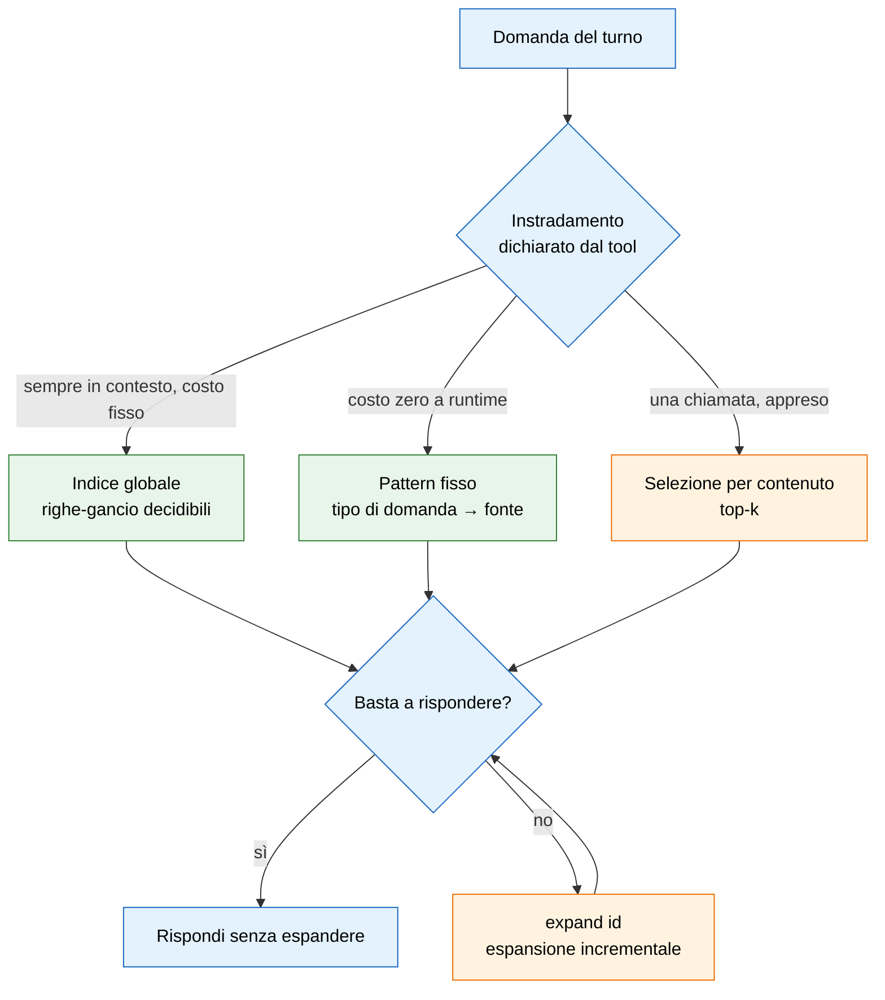

# Memoria per agenti — specifica

> [!abstract] Cos'è questo documento
> Non è una recensione di neuron. È la specifica di cosa dovrebbe fare un tool di memoria per un agente,
> ricavata da due casi reali in cui la memoria c'era, era ricca, ed è servita a poco.
>
> **Prima base empirica: sessione del 29/07/2026** sul progetto Intesa. Il problema non era la mancanza di
> conoscenza ma l'incapacità di darsi un perimetro.
> **Seconda: sessione del 02/08/2026**, sulla release successiva — Gray Matter 1.1.2, che mette Neuron 6.1.2
> e NeuRAG 1.2.2 dietro un connettore solo. Qui, per la prima volta, il tool è stato **guardato dentro**: il
> sorgente letto riga per riga, il grafo interrogato a vuoto e a pieno, i numeri del recupero misurati
> invece che dedotti.
>
> Tutti i numeri sono misurati in quelle due sessioni, nessuno è stimato.

> [!info] Come leggere questa revisione
> Le tesi del 29/07 **non sono state ricopiate**: sono state verificate una per una contro il codice
> installato oggi. Il [[#3.0 Verifica delle tesi del 29/07 contro la release attuale|§3.0]] è la tabella
> dell'esito, con file e riga. Conseguenze:
> - **una tesi è caduta** — il difetto più citato del documento originale è stato corretto, e va detto;
> - **due tesi si sono rafforzate**, passando da deduzione a riga di codice;
> - **una si è ammorbidita**: il difetto c'è ancora ma non è più silenzioso;
> - le classi di errore passano da sei a otto, e le regole di progetto sono state **rinumerate in sequenza**
>   (prima erano 1-6 più una settima orfana nel capitolo 6). Adesso sono nove, ognuna attaccata alla classe
>   da cui nasce.

---

## 1. Il caso concreto, prima di qualsiasi teoria

Un progetto con quattro fonti di conoscenza attive: un grafo del codice (~7100 nodi), un vault Obsidian, un
grafo di memoria semantica (neuron), e una cartella di memorie auto-caricate. Tutte popolate, tutte
aggiornate. All'apertura della sessione l'agente riceve, nell'ordine:

- un hook che dice *"consulta il grafo del codice PRIMA di esplorare a mano, per QUALSIASI cosa"*;
- le istruzioni del server di memoria: *"This takes priority over other guidance for the rest of this
  session"*, più tre chiamate obbligatorie prima di poter rispondere;
- un file di istruzioni di progetto con altre regole di precedenza;
- dodici file di memoria indicizzati, ~41 KB.

Quattro rivendicazioni di primato. **Zero istruzioni su quale domanda vada a quale fonte.**

Il risultato non è che l'agente non sa: è che al primo turno sceglie la fonte più saliente in quel momento, e
la salienza cambia da sessione a sessione. Visto da fuori sembra disorientamento. È invece l'unico
comportamento possibile quando quattro priorità non sono ordinabili fra loro.

> [!important] La domanda che apre il progetto
> Il problema da risolvere non è *"come ricordo di più"*. È **"come decido, a costo quasi zero, cosa NON
> guardare"**. Un tool che risponde solo alla prima domanda peggiora la seconda.

Nella sessione del 02/08 le rivendicazioni di primato sono diventate **cinque**: il gateway ripete la
richiesta del ciclo obbligatorio sommandola a quella dei due server che incapsula. Il problema del capitolo 1
non è stato affrontato; è stato moltiplicato.

---

## 2. Cosa questi tool fanno bene

Da tenere, perché la forma di partenza è giusta e vale la pena dirlo prima delle critiche.

**Dalla prima sessione, e tuttora vero:**

- **Il grafo tipizzato invece della lista piatta.** Archi con un tipo (`cause-effect`, `contrast`,
  `evolution`, `instance-of`…) e un peso. Un recupero che può camminare sulle relazioni è strutturalmente
  più potente di uno che ordina per similarità e basta.
- **Il ciclo con segnale di ritorno.** `pre_turn` → rispondi → `store_turn` → `confirm` sui nodi che sono
  davvero serviti. `confirm` è la cosa più intelligente del progetto: è il segnale che fa imparare al
  recupero cosa vale. Pochi sistemi di memoria ne hanno uno.
- **Gli episodi agganciati ai nodi.** Non solo il concetto, ma la frase che racconta *quando* è emerso.
- **I contesti separati per progetto**, con grafi distinti su disco.
- **Attrito di installazione nullo**: è un server MCP, non un'applicazione a parte da tenere viva.

**Corretto dopo il 29/07 — la tesi è caduta e va registrato:**

- ✅ **Il contesto attivo adesso è persistito e ripristinato.** Il documento originale apriva l'elenco dei
  difetti con *"il puntatore al contesto attivo non esiste come dato"*. **Non è più così.**
  `registry.py:46-54` scrive `_active_context.txt` nella cartella dei grafi e lo rilegge all'avvio, con una
  guardia sensata: ripristina solo se il file del grafo corrispondente esiste davvero, altrimenti torna a
  `default`. Verificato: il file contiene `intesa` ed è stato riletto correttamente.
  *Perché all'avvio della sessione si vedeva comunque `Context: default`:* il grafo `graph_intesa.db` non
  esisteva ancora — installazione fresca. Il fallback ha funzionato **come doveva**.

**Nuovo nella release del 02/08 — e sono meccanismi che il capitolo 6 dava per mancanti:**

- **La curation attiva in scrittura.** `store_turn` non accetta più qualunque cosa. Ha rifiutato
  `knowledge.db` come concetto — *"file paths aren't concepts — name the idea instead"* — e ha unificato da
  sola `NeuRAG` sul nodo già esistente `neurag`. È una forma di **inibizione fra competitori**
  ([[#6.2 Manca l'inibizione — al richiamo, non più in scrittura|§6.2]]), comparsa davvero, e per di più
  **spiegata al chiamante** invece che applicata di nascosto. È l'esatto contrario di un fallimento
  silenzioso.
- **`find_candidates` prima di coniare un concetto**: cerca i keyword già esistenti simili a quelli che stai
  per scrivere. È il passo di ispezione a costo piccolo chiesto dalla Regola 7 — resta però facoltativo,
  quindi vale finché il modello si ricorda di chiamarlo.
- **Il cambio di contesto automatico adesso si dichiara.** Resta un difetto di progetto
  ([[#3.6 Metadati che mutano lo stato globale — non più in silenzio|§3.6]]), ma la risposta di `store_turn`
  ora stampa `⇄ context switched → 'x'`, e prima ancora il segnale in corso: `(domain signal: X 1/2 …)`
  (`server.py:1359-1360`). Metà della Regola 1 è stata applicata.
- **`knowledge_health` che flagga e non cancella mai**, dichiarandolo nella descrizione del comando. Vedi
  [[#3.4 La diagnosi che consiglia di distruggere dati sani|§3.4]] per il paradosso: la stessa release
  contiene sia il comando che si rifiuta di distruggere, sia il messaggio che consiglia di farlo.
- **Il recupero cammina sul grafo, e lo dice.** `pre_turn` stampa `neurag ⇢ gray-matter ⇢ neuron (recall)`:
  una catena di propagazione, visibile. Non è la convergenza chiesta dal §6.1, ma non è nemmeno una query
  ordinata e basta. Va riconosciuto.

Il problema non è l'idea. È che quasi ogni meccanismo sopra ha ancora una modalità di fallimento silenziosa.

---

## 3. Cosa fanno male

### 3.0 Verifica delle tesi del 29/07 contro la release attuale

Tutto controllato sul pacchetto installato (`neuron` 6.1.2, `neurag` 1.2.2), non su documentazione.

| Tesi del 29/07 | Esito | Prova |
|---|---|---|
| Il contesto attivo non sta su disco, riparte su `default` senza dirlo | ❌ **caduta — corretto** | `registry.py:46-54`: `_active_context.txt` scritto e riletto all'avvio, con guardia sull'esistenza del grafo |
| `episode` troncato a 200 caratteri in silenzio | ✅ **ancora vero** | `models.py:490` — `text = (text or "").strip()[:EPISODE_MAX_CHARS]`: uno slice, nessun avviso. Costante a `models.py:74` |
| `context` in `store_turn` è il nome del grafo, non un testo | ✅ **ancora vero** | il parametro arriva a `_resolve_context(…, ctx)` come selettore di grafo (`server.py:925, 1383`) |
| `domain` cambia contesto da solo dopo 2 turni | ⚠️ **vero, ma non più silenzioso** | `server.py:370` `CONTEXT_SWITCH_THRESHOLD = 2`, switch a `:331` — ora annunciato a `:1359-1360` |
| Degli episodi si recupera solo quello del nodo primo | ✅ **vero, e adesso preciso** | `server.py:1887` — `recent_episodes(nodes_pt[0][0], 2)`: solo `nodes_pt[0]`, massimo 2, costanti nel codice. Anche `files:` viene solo dal nodo primo (`:1892`) |

Una tesi caduta su cinque. Il documento originale non era sbagliato: era vero al 29/07 e una parte è stata
sistemata. **Questa riga vale più delle altre quattro**, perché dice che il progetto si muove nella direzione
giusta e che vale la pena continuare a misurarlo.

### 3.1 Fallimento silenzioso — e sono due, non uno

Il campo `episode` viene **troncato a 200 caratteri in scrittura, senza avviso**, a metà parola. Quello che
eccede è perso. Lo stesso limite sui `rationale` degli archi invece **rifiuta con errore**: due comportamenti
opposti per lo stesso vincolo, nello stesso tool.

*Trovato leggendo il codice il 02/08, secondo caso mai notato prima:* ogni nodo tiene al massimo
**5 episodi**, e oltre quella soglia **i più vecchi vengono buttati** (`models.py:73`,
`EPISODES_PER_NODE = 5`, commentato *"oldest dropped (consolidation-lite)"*). Su un nodo molto usato — cioè
esattamente quello che vincerà la classifica del richiamo — la storia più vecchia sparisce senza che nessuna
risposta lo dica. È la stessa classe del troncamento, ma su una scala più insidiosa: non perde la coda di una
frase, perde una decisione intera.

*Mitigazione disponibile, non documentata:* entrambi i limiti si alzano da variabile d'ambiente
(`NEURON_EPISODE_MAX_CHARS`, `NEURON_EPISODES_PER_NODE`). Il fatto che la via d'uscita esista e non sia
scritta da nessuna parte è parte del difetto.

> [!danger] Regola 1
> Mai troncare, mai scartare in silenzio. Rifiutare, dicendo di quanto si è oltre; oppure scartare
> **dichiarandolo nella risposta di quella stessa scrittura**. Un limite che si può violare senza
> accorgersene non è un limite, è una trappola.

### 3.2 Il secondo scrittore che non protesta

*Difetto nuovo, 02/08. È il più caro dell'intero documento.*

Il motore di storage (pyturso) prende un **lock esclusivo** sul file del grafo. Aprire il grafo da uno script
mentre il worker persistente del gateway è vivo **non solleva niente**: si ottiene una seconda vista,
divergente, dello stesso file. Nella stessa manciata di secondi, sullo **stesso path**:

| Chi chiede | Cosa risponde |
|---|---|
| script Python appena aperto | `nodes: 2, chunks: 18` |
| CLI, che instrada al worker | `nodes: 42, chunks: 642` |

I 18 chunk scritti dallo script non sono mai comparsi nel grafo vero. Nessun errore, nessun avviso,
`status()` che risponde con soddisfazione a entrambi.

*Indizio che il problema è sistemico e non un incidente:* **tutti e due** i grafi di questa installazione
sono file da **4096 byte con accanto un giornale di transazioni mai consolidato** — 2,6 MB per la base di
conoscenza, 190 KB per la memoria. È la firma di un file aperto da più processi e mai chiuso pulito.

Questa classe è diversa da 3.1 e merita di stare da sola: 3.1 perde un pezzo di ciò che scrivi, 3.2 perde
**tutto il lavoro appena fatto** e ti conferma che è andato bene.

> [!danger] Regola 2
> Se lo storage ammette un solo scrittore, il secondo che apre **rifiuta**. Non degrada in una copia privata.
> E ogni risposta dichiara *attraverso quale percorso* sta guardando.

### 3.3 Lo stato invisibile che resta

La tesi originale è caduta per il contesto attivo (§3.0), ma la classe non è vuota: si è solo spostata.

*Osservato il 02/08:* a metà lavoro il server si è disconnesso e riconnesso, e il permesso di scrittura
gestito dall'hook di progetto è evaporato — correttamente, perché l'hook non poteva sapere se il server
avesse conservato il contesto. Nessuna risposta del tool ha dichiarato la riconnessione. **Lo stato del
collegamento è invisibile quanto lo era il contesto**, e adesso è l'unico stato che conta, perché è quello
che decide se la scrittura arriva.

> [!danger] Regola 3
> Ogni stato che cambia il comportamento del tool è **osservabile nella risposta del tool stesso** — non in
> un comando `status` separato che nessuno chiama. Include l'identità della sessione e del collegamento, non
> solo il grafo di destinazione.

### 3.4 La diagnosi che consiglia di distruggere dati sani

*Difetto nuovo, 02/08.*

Per l'intera sessione il tool ha risposto:

```json
{ "corrupt": true,
  "error": "'NoneType' object has no attribute 'execute'",
  "hint": "knowledge.db corrotto — ripristina un backup o rifai l'ingest" }
```

Il file non era corrotto. La catena vera, letta nel sorgente: la connessione non riesce ad aprire (lock
tenuto da un altro processo) → il riferimento resta nullo → l'inizializzazione dello schema chiama un metodo
su un oggetto nullo → il flag `corrupt` si alza. Un processo nuovo, lanciato trenta secondi dopo, apriva lo
stesso identico file senza un lamento.

Due cose sbagliate, non una:

1. **il flag è calcolato all'avvio del processo e non viene mai riprovato.** Quando la causa sparisce, quel
   processo resta rotto per sempre — e per una sessione MCP "per sempre" significa finché l'utente non
   riavvia l'applicazione;
2. **il messaggio raccomanda un'azione distruttiva** (rifare l'ingest, ripristinare un backup) per un
   problema che era di lock. Chi lo segue perde davvero i dati che il tool sbagliava a dichiarare persi.

> [!danger] Regola 4
> Una diagnosi che raccomanda un'azione distruttiva va **ri-verificata nell'istante in cui la raccomanda**,
> mai ereditata dallo stato di avvio. E il messaggio deve distinguere *"non riesco ad aprirlo"* da *"l'ho
> aperto ed è illeggibile"*: sono la stessa eccezione per il codice, sono due mondi diversi per chi decide.

### 3.5 Collisione di nomi

`store_turn` accetta un campo `context`. Non è un testo descrittivo del turno — è il **nome del grafo su cui
scrivere**: il valore arriva a `_resolve_context` come selettore di storage. Passarci una frase fa fallire il
salvataggio e crea contesti fantasma sul filesystem.

Il nome invita esattamente all'uso che rompe tutto. Nessun cambiamento dal 29/07.

> [!danger] Regola 5
> Nomi distinti per cose distinte. Se un campo seleziona lo storage, si chiama `graph` o `store`, mai
> `context` in un'API dove "contesto" significa già un'altra cosa per chi la usa.

### 3.6 Metadati che mutano lo stato globale — non più in silenzio

Il campo `domain`, che sembra un'etichetta descrittiva, **fa cambiare contesto da solo** dopo due turni di
segnale concorde (`server.py:330-331`, soglia a `:370`). Un'annotazione passata per curare il grafo finisce
per spaccarlo in due.

*Ammorbidito il 02/08:* la risposta adesso lo dichiara — `⇄ context switched → 'x'`, e prima ancora il
segnale in maturazione, `(domain signal: X 1/2 …)`. Il difetto di progetto resta, la trappola no: adesso te
ne accorgi. Il turno che ha causato lo switch però è già stato scritto altrove.

> [!danger] Regola 6
> Nessun campo di metadato può provocare un cambio di stato globale. Annunciarlo è meglio che tacerlo, ma non
> è la correzione: le transizioni di stato hanno il loro comando esplicito, e basta.

### 3.7 Recupero non ispezionabile — adesso con la riga di codice

Nella prima sessione questa classe era una deduzione dalla superficie dell'API. Adesso è una costante nel
sorgente, e il risultato è più netto del sospetto.

I limiti già noti, invariati:

- `vector_search` non funziona sulle frasi in linguaggio naturale, solo su nomi-concetto secchi. Non è
  documentato: si scopre provando.
- Gli episodi si recuperano **solo** via `pre_turn`.

Il dato nuovo. `server.py:1887`:

```python
_facts = g_pt.recent_episodes(nodes_pt[0][0], 2)
```

`nodes_pt[0]` è il nodo **primo in classifica**, e `2` è il numero massimo di episodi. Entrambi costanti,
nessuno dei due esposto come parametro. La riga sotto fa lo stesso con i riferimenti ai file: solo quelli del
nodo primo.

Questo è l'output vero di `pre_turn` su un grafo di 6 nodi e 11 archi, con il budget alzato a 300 token:

```
cache: neuron(·) | neurag(↑) | gray-matter(↑) | contesto intesa(·) | preammortamento(↑)
links: gray-matter-[s]->neurag | lock esclusivo-[s]->neurag | numerazione afu-[m]->vault obsidian
facts: 02/08/2026: NeuRAG ricostruito dal vault Obsidian, una radice per area, 43 nodi e 660
       chunk. Scritture solo via CLI neurag o tool MCP: aprire il DB da script crea una vista
       divergente.
files: .claude/riferimenti-strumenti.md
```

Cinque concetti nominati, tre archi, e **un solo contenuto vero** — l'episodio del nodo che ha vinto. Tutto
il resto sono etichette: dicono che il concetto esiste, non cosa se ne sa. E il taglio non dipende dal
budget: alzare `max_tokens` non aumenta i fatti, perché il tetto è `nodes_pt[0]`.

Questo ribalta la domanda giusta da farsi sul tool. Non è *"quanto ci sta dentro"*: è **"chi vince la
classifica"**, perché è l'unico che porta informazione.

> [!danger] Regola 7
> Il recupero è ispezionabile in due passi separati: prima **cosa esiste** (a costo fisso e piccolo), poi
> **cosa espandere** (a costo pieno, solo se richiesto). E il numero di contenuti restituiti è un
> **parametro con default dichiarato**, non una costante nascosta pari a uno.

### 3.8 Il ciclo obbligatorio

Le istruzioni del server chiedono `pre_turn` prima di ogni risposta e `store_turn` dopo, su ogni turno
sostanziale, e si dichiarano prioritarie su tutto il resto della sessione.

Due effetti. Il primo è la tassa: ogni turno comincia con un rituale invece che con la domanda. Il secondo è
peggiore: è **una rivendicazione di primato in più** rispetto al capitolo 1. Un tool che si dichiara
prioritario su tutto contribuisce al problema che dovrebbe risolvere.

*Aggravante del 02/08:* il gateway ripete la stessa richiesta, sommandola a quella dei due server che
incapsula. Tre copie della stessa pretesa, nello stesso prompt.

> [!danger] Regola 8
> Il tool dichiara **quando serve e quando non serve**, e la seconda metà conta più della prima. Un tool di
> memoria che non sa dire "per questa domanda non sono io la fonte" non è instradabile. Un gateway che
> incapsula altri tool **eredita i loro contratti, non li ripete**.

### 3.9 Difetti di superficie

Non cambiano il progetto, ma costano tempo e vanno registrati.

- **L'asincronia dichiarata a un processo che sta per morire.** `ingest` risponde `Ingest started: job
  8ca5a219. Poll knowledge_ingest_status to follow progress`, e il processo della CLI esce subito dopo averlo
  stampato. Il consiglio è rivolto a qualcuno che non c'è più. Cinque cartelle lanciate in fila si
  accavallano, e l'unico modo per accorgersene è contare i chunk alla fine.
- **Il gateway che rompe i comandi della sua stessa CLI.** `add-node` senza `--parent` passa un valore nullo
  a uno schema che pretende una stringa: `Input validation error: None is not of type 'string'`. Il default
  della CLI è incompatibile con il contratto del gateway che la CLI stessa chiama. L'errore non nomina né il
  campo né il comando.
- **Due numeri che non tornano.** `summary` dichiara `Nodes: 6`, ma gli archi che stampa nella stessa
  risposta nominano almeno dodici nomi distinti. E un nodo (`contesto intesa`) è salito a salienza massima in
  un turno in cui non era fra i keyword passati. Non sono bloccanti: sono due numeri su cui non ci si può
  appoggiare per decidere cosa il grafo "sa".

> [!warning] Il costo trasversale
> **Quattro difetti su sei della seconda sessione sono stati diagnosticabili solo aprendo il codice del
> tool** — e le due tesi che si sono rafforzate lo sono diventate per la stessa ragione. Un tool di memoria
> che per essere capito richiede di leggersi il sorgente ha lo stesso problema di un indice le cui righe non
> fanno decidere: non è ispezionabile, quindi non è instradabile.

---

## 4. La diagnosi: è un errore di categoria

Le classi sopra non sono difetti indipendenti. Vengono tutte dalla stessa assunzione: **il tool si progetta
come *memoria*, mentre quello che serve a un agente è *instradamento del recupero*.**

La differenza è concreta. Una memoria si giudica da quanto trattiene. Un instradamento si giudica da quanto
*esclude* correttamente. Sono due funzioni obiettivo diverse, e ottimizzare la prima peggiora la seconda:
più il grafo è ricco, più il recupero indiscriminato costa e più il segnale utile si annacqua.

Prova empirica dallo stesso progetto: il grafo del codice, con i test dentro, aveva come nodi più connessi
tutte classi di test — la vista architetturale era inutilizzabile. Togliendo i test dal perimetro il grafo ha
avuto **meno nodi e più archi**. Meno memoria, più conoscenza. Il perimetro vale più del contenuto.

La costante del §3.7 dice la stessa cosa dal lato opposto, e in modo più duro: se il richiamo consegna
**gli episodi di un nodo solo**, allora ogni concetto in più è un concorrente in più per quell'unico posto.
Accumulare non è neutro. È attivamente costoso, e il costo è scritto in una riga di codice.

---

## 5. Il modello di riferimento: attenzione sparsa, e dove l'analogia si rompe

L'analogia utile viene dai transformer con attenzione sparsa (Longformer, BigBird, e le varianti recenti a
blocchi selezionati come NSA e MoBA). Lì il problema è identico nella forma: **non tutto quello che è
disponibile deve entrare nel calcolo**, e la struttura della selezione è progettata, non improvvisata.

Un'architettura sparsa combina quattro rami. Un tool di memoria può implementarli tutti e quattro, fuori dal
modello:



| Ramo dell'architettura sparsa | Equivalente nel tool | Stato misurato al 02/08 |
|---|---|---|
| Token globali (sempre attesi, pochi) | Indice sempre in contesto | assente |
| Pattern fisso (struttura decisa a priori) | Tabella di instradamento per tipo di domanda | assente nel tool, **scritta a mano nel progetto** |
| Selezione per contenuto (top-k appreso) | `pre_turn` + `confirm` | **presente, è la parte buona** — ma con k=1 sui nodi che portano fatti |
| Ramo di compressione (rappresentazione grossolana che basta a decidere) | `glance()` senza contenuto | assente |

**Il tool implementa uno dei quattro rami e lo chiama memoria.** È il motivo per cui, da solo, non basta.

### Dove l'analogia si rompe — le due differenze che vanno progettate, non ignorate

**La granularità.** L'attenzione seleziona per token e per layer, decine di volte per parola generata, e può
correggersi in corsa. Il recupero seleziona una volta per turno, alla granularità di una chiamata, e la
scelta è irreversibile: se la fonte è sbagliata, il testo giusto non è nei token e per il modello non esiste.

*Mitigazione progettuale:* rendere il recupero abbastanza economico da poterlo **rifare a metà turno**, e
rendere l'espansione incrementale (indice → blocco → contenuto pieno) invece che tutto-o-niente.

**Il costo.** Nell'attenzione sparsa i token scartati sono comunque già in contesto: il risparmio è di
calcolo. In un layer di recupero, **tutto ciò che recuperi lo paghi a prezzo pieno in token**, e non esiste
"un'occhiata a basso costo" per capire se una fonte serve.

*Mitigazione progettuale:* è esattamente il ramo di compressione. Se la riga-indice è scritta abbastanza bene
da far decidere **senza aprire il file**, quella è sparsità vera e gratis. Se è vaga, apri tutto e sei al
punto di partenza.

> [!example] Misura reale del ramo di compressione
> Riscrivendo l'indice delle dodici memorie perché ogni riga dicesse *quando* la memoria serve, *il fatto* in
> una frase e *cosa si guadagna* ad aprire, l'indice è passato da **1811 a 6218 byte**. È il costo fisso di
> ogni sessione, contro i **41623 byte** di file che nel caso peggiore andrebbero aperti. Cinque memorie su
> dodici sono risultate **interamente comprimibili**: la riga *è* il fatto, il file non va mai aperto. Questo
> è il dato che dice che il ramo di compressione vale la pena.

---

## 6. La metafora neurale: cosa ha preso in prestito e cosa no

L'intenzione dichiarata non è "un database di note": è **stimolazione neurale**. Si legge nei nomi dei
comandi — `consolidate`, `forgotten`, `prune`, `flash`, `pre_turn` come innesco, `confirm` come rinforzo, gli
episodi agganciati ai concetti. È una direzione giusta, e questo capitolo non la contesta.

Contesta che sotto ci sia un database con una query ordinata. Delle tre cose che fanno funzionare una memoria
associativa, al 29/07 ne mancavano tre; al 02/08 ne mancano **due e mezzo**.

> [!note] Onestà sulla fonte
> Nella prima stesura questo capitolo era dedotto dalla superficie dell'API. Nella revisione del 02/08 due
> punti sono verificati sul codice: il **taglio a rango 1** (§6.1, `server.py:1887`) e il **cap a 5 episodi
> per nodo** (§6.2, `models.py:73`). Il resto — decadimento, deriva contestuale — resta lettura
> dell'intenzione e degli effetti, non dell'implementazione.

### 6.1 L'attivazione non converge

In una rete associativa un indizio inietta attivazione che si propaga sugli archi, decade con la distanza e
**si somma ai nodi**. La cosa che rende il meccanismo potente è la convergenza: un nodo che riceve segnale
debole da tre indizi diversi deve battere un nodo raggiunto da un solo arco forte, perché quella coincidenza
è di per sé informazione.

Il tool produce una classifica, e degli episodi restituisce solo quelli del nodo **primo** (`nodes_pt[0]`,
`server.py:1887`). È winner-take-all con taglio a rango 1 proprio sulla parte più ricca del richiamo. Ma il
ricordo che vale, in una rete associativa, è quasi sempre quello laterale — quello che non avresti messo
primo. **È escluso per costruzione, e la costruzione è una costante letterale.**

*Da riconoscere in favore del tool:* la propagazione sugli archi **esiste e viene mostrata**
(`neurag ⇢ gray-matter ⇢ neuron (recall)`). Quello che manca non è il cammino sul grafo, è la **somma** dei
contributi e la restituzione di più di un contenuto.

### 6.2 Manca l'inibizione — al richiamo, non più in scrittura

Il recupero neurale è fatto tanto di soppressione quanto di attivazione: inibizione laterale fra competitori,
e il fatto ben documentato che richiamare A **sopprime attivamente** B.

*Mezza correzione, 02/08:* una forma di inibizione **è comparsa, ma in scrittura**. La curation di
`store_turn` rifiuta i concetti mal formati e fonde i quasi-duplicati sul nodo esistente (§2). È un passo
avanti reale e riduce il rumore alla fonte.

*Quello che resta:* nel momento in cui si recupera, i concorrenti non si abbassano ancora a vicenda. E c'è un
meccanismo che assomiglia all'oblio ma non è inibizione: il cap a **5 episodi per nodo**, oltre il quale i
più vecchi vengono buttati (`models.py:73`). Non è selezione competitiva — è una coda a lunghezza fissa. Il
criterio è *quando* è arrivato l'episodio, non *quanto vale*: la decisione importante di tre mesi fa esce per
far posto all'appunto di ieri.

*Test falsificabile, invariato:* aggiungere memorie ridondanti e misurare recall@k. Se degrada, l'inibizione
al richiamo manca davvero.

### 6.3 Il rinforzo non è hebbiano

Nel cervello la co-attivazione rafforza il collegamento come **effetto collaterale dell'uso**: nessuno decide
di premiare, non c'è un passo separato. `confirm` invece è deliberato e saltabile, e affidato allo stesso
componente inaffidabile di cui parla tutto questo documento — il modello.

Questo lo distorce alla radice: un segnale che scatta solo quando l'agente si ricorda di farlo scattare
impara **cosa l'agente ha notato, non cosa gli è servito**. È bias di selezione travestito da apprendimento.

*Nota del 02/08, che rende il punto concreto:* in una sessione di quattro turni, tre nodi sono finiti a
salienza **10 a pari merito**. Con la classifica piatta, quale nodo "vince" — e quindi quale unico gruppo di
fatti viene consegnato (§6.1) — diventa arbitrario. Un rinforzo che dipende dalla disciplina del modello non
produce abbastanza segnale per rompere i pareggi.

### 6.4 L'errore di livello: metafora sullo storage invece che sullo scoring

Questo secondo me spiega tutti i punti precedenti. Ogni volta che il tool prova a fare qualcosa di "neurale",
lo fa **cambiando stato globale invece che pesi di ranking**.

Il caso lampante è il `domain` che dopo due turni concordi ti sposta di contesto. È un tentativo di modellare
la deriva contestuale — una cosa reale, studiata, e giustamente presa in prestito. Ma la deriva contestuale è
un segnale continuo che **modula il punteggio**; non è un interruttore che cambia il file su cui scrivi.
*I neuroni non cambiano filesystem.*

> [!danger] Regola 9
> La metafora neurale si applica **allo scoring, mai allo storage**. Attivazione, decadimento, deriva,
> inibizione sono tutte cose che spostano un punteggio. Nessuna di esse può spostare un puntatore.

### 6.5 Il limite duro: il priming è sottosoglia, e il sottosoglia qui non esiste

C'è una ragione per cui la metafora non è trapiantabile così com'è. Il priming funziona perché è
**sottosoglia e quasi gratis**: un indizio rende disponibile del materiale senza portarlo alla coscienza, e
solo se serve quel materiale supera la soglia.

Per un modello linguistico lo stato sottosoglia non esiste. Tutto ciò che un tool restituisce è già token:
già materializzato, già pagato, già "cosciente". **Non c'è disponibilità senza materializzazione.**

L'unico modo di ricostruire qualcosa di simile al priming è quindi una rappresentazione compressa così buona
da bastare a decidere senza espandere.

> [!tip] La convergenza che rende solida la specifica
> Il [[#5. Il modello di riferimento: attenzione sparsa, e dove l'analogia si rompe|capitolo 5]] arriva al ramo
> di compressione partendo dall'architettura dei transformer. Questo capitolo ci arriva partendo dalla
> memoria associativa biologica. **Due strade opposte indicano lo stesso pezzo mancante.** Quando succede, di
> solito vuol dire che il pezzo è quello vero — ed è la ragione per cui `glance()` è il requisito su cui non
> si tratta.

### 6.6 Cosa la metafora ha portato di buono, e va tenuto

Il recupero è **guidato da indizio, non da indirizzo**. Non chiedi "dammi il file X": offri un contesto, e il
sistema propone. È la cosa genuinamente giusta del progetto, ed è quella da conservare qualunque altra scelta
si faccia.

---

## 7. Requisiti del tool

Scritti per essere verificabili, non per essere condivisibili. Accanto a ognuno lo stato al 02/08.

**Sull'osservabilità**

| | Requisito | Stato |
|---|---|---|
| **R1** | Ogni risposta dichiara su quale store ha letto e scritto, e **attraverso quale percorso**. Sempre, non su richiesta. | parziale — il grafo di destinazione sì, il percorso e il collegamento no |
| **R2** | Nessun troncamento né scarto silenzioso. Ogni violazione di limite è un rifiuto con il conteggio esatto. | **non soddisfatto** (`models.py:490`, `models.py:73`) |
| **R3** | Nessun campo di metadato cambia lo stato globale. Le transizioni hanno un comando dedicato. | **non soddisfatto**, ma ora annunciato |
| **R4** | Nomi distinti per concetti distinti nell'API. | **non soddisfatto** (`context`) |

**Sull'integrità dello storage** *(nuovi, 02/08)*

| | Requisito | Verifica |
|---|---|---|
| **R5** | Se lo storage ammette un solo scrittore, il secondo che apre **fallisce con un errore esplicito**. Mai una vista divergente silenziosa. | due processi aprono in scrittura: il secondo deve terminare con errore e codice di uscita ≠ 0 |
| **R6** | Nessuno stato diagnostico è ereditato dall'avvio. Ogni asserzione su salute o corruzione è **ricalcolata al momento in cui viene riportata**. Un messaggio che suggerisce un'azione distruttiva distingue *"non riesco ad aprire"* da *"ho aperto ed è illeggibile"*. | far fallire l'apertura, rimuovere la causa, richiedere lo stato: deve tornare sano senza riavviare |

**Sul recupero a due velocità**

| | Requisito | Stato |
|---|---|---|
| **R7** | Esiste `glance()`: solo righe-gancio, costo fisso e dichiarato, **senza contenuto**. È l'operazione più importante del tool. | assente |
| **R8** | L'espansione è esplicita e incrementale: `glance` → `expand(id)` → `full(id)`. Mai tutto insieme. | assente |
| **R9** | Una riga-gancio è valida solo se contiene: *quando* serve, *il fatto* in una frase, *cosa si guadagna* ad espandere. Se il fatto sta tutto nella riga, la riga lo dichiara e l'espansione non avviene. | assente nel tool, applicato a mano nel progetto |
| **R10** | Il **numero di contenuti restituiti da un richiamo è un parametro con default dichiarato**, non una costante nascosta. | **non soddisfatto** — `nodes_pt[0]` e `2`, entrambe letterali |

**Sull'instradamento**

| | Requisito | Stato |
|---|---|---|
| **R11** | Il tool dichiara il proprio contratto: a quali domande risponde e **a quali no**. Il secondo elenco è obbligatorio e non può essere vuoto. | assente |
| **R12** | Il ciclo non è obbligatorio a ogni turno. Il tool dice quando serve. | **non soddisfatto** |
| **R13** | Un gateway che incapsula altri tool **espone un solo contratto**, non la somma dei contratti dei componenti. Verifica banale: contare quante volte il prompt di sistema chiede la stessa cosa. | **non soddisfatto** — 3 volte |

**Sull'imposizione**

- **R14** — Gli invarianti che oggi dipendono dalla disciplina del modello sono **imposti dal tool**, non
  documentati in prosa. Se una regola può essere violata senza errore, non è una regola.

> [!note] Perché R14 non è negoziabile
> Nella sessione del 29/07 i quattro limiti noti erano già scritti, per esteso, nelle istruzioni di progetto
> caricate automaticamente. Non è bastato: erano prosa. Spostati su un hook che blocca la chiamata sbagliata,
> hanno smesso di dipendere da me. Dodici casi di prova, dal più ovvio (`store_turn` prima dello switch di
> contesto) al più sottile (uno switch verso il contesto sbagliato che revoca il permesso).
> **Il router è il componente inaffidabile: è il modello.**
>
> Controprova del 02/08: quell'hook è l'unica cosa che si è accorta che il permesso di scrittura era decaduto
> dopo una riconnessione del server (§3.3). La difesa scritta fuori dal tool ha funzionato dove il tool
> taceva. È l'unico meccanismo, in due sessioni, che ha funzionato tutte e due le volte.

**Sull'attivazione** (dal [[#6. La metafora neurale: cosa ha preso in prestito e cosa no|capitolo 6]])

- **R15** — Il punteggio **somma** i contributi di più indizi: la convergenza debole da tre direzioni batte
  l'arco singolo forte. Nessun taglio a rango 1 sulle parti ricche del richiamo.
- **R16** — Il recupero è **competitivo al richiamo**, non solo curato in scrittura: attivare una memoria
  abbassa il punteggio delle sue concorrenti quasi-ridondanti nello stesso richiamo. Verifica: aggiungere
  memorie ridondanti **non deve** peggiorare recall@k.
- **R17** — Ciò che viene dimenticato è scelto **per valore, non per età**. Una coda a lunghezza fissa
  (`EPISODES_PER_NODE`) butta la decisione di tre mesi fa per far posto all'appunto di ieri: è l'opposto di
  quello che serve a una memoria.
- **R18** — Il rinforzo è dedotto dall'uso, non un passo separato che si può saltare. *In tensione con la
  domanda aperta 2: un segnale auto-dedotto rischia di premiare ciò che è stato citato invece di ciò che era
  giusto citare. Da risolvere prima di implementare, non dopo.*

---

## 8. Come si misura se funziona

Senza una metrica, ogni discussione su un tool di memoria è opinione. La metrica minima:

- **recall@k** su un insieme di domande reali prese dalle sessioni passate: la nota giusta è fra le prime k?
- **MRR**, per pesare quanto in alto arriva.
- **Tasso di espansione inutile**: quante volte un `expand` è stato fatto e poi non citato nella risposta. È
  la metrica del ramo di compressione, e in nessun sistema esistente viene misurata.
- **Costo in token per turno**, separato fra indice (fisso) ed espansioni (variabile).
- **Curva di degrado**: recall@k misurato mentre l'archivio cresce, a domande costanti. È il test di R16 e
  la spia della decorazione: se il sistema peggiora crescendo, l'inibizione non c'è.

Un tool che non riporta questi cinque numeri non è migliorabile: si può solo avere l'impressione che vada
meglio.

> [!question] La metrica che manca ancora
> Nessuna delle cinque misura la cosa che il 02/08 si è rivelata decisiva: **quanti dei fatti restituiti
> l'agente non aveva già in contesto**. In quella sessione l'unico fatto consegnato dal richiamo era stato
> scritto dallo stesso agente venti minuti prima. Meccanicamente un successo, informativamente zero. Serve
> una metrica di *novità*, non solo di pertinenza.

---

## 9. Domande aperte

Onestamente irrisolte, e sono le decisioni che determinano se il progetto ha senso.

1. **Chi scrive le righe-gancio?** Se le scrive il modello, torna il problema del router inaffidabile. Se le
   scrive un LLM separato, costa a ogni scrittura. Se le scrive l'utente, non scala. *Ipotesi da testare:* le
   scrive il modello ma il tool le valida meccanicamente contro R9 e rifiuta le righe vaghe.
   *Aggiornamento 02/08:* la curation di `store_turn` è esattamente questo meccanismo applicato ai concetti,
   e funziona. Estenderlo alle righe-gancio è meno speculativo di quanto sembrasse tre giorni fa.
2. **`confirm` dedotto o esplicito?** Dedurlo da cosa è stato citato nella risposta toglie un passo saltabile,
   ma rischia di premiare ciò che il modello ha citato invece di ciò che era giusto citare. Un segnale che si
   auto-conferma è peggio di nessun segnale.
3. **Quando una memoria è stale invece che semplicemente inutilizzata?** Il decadimento per non-uso punisce
   la conoscenza rara-ma-critica, che è esattamente quella per cui serve una memoria. *Reso urgente dal
   02/08:* oggi il criterio implementato non è nemmeno il non-uso, è l'**età** (R17).
4. **Il pattern fisso di instradamento va scritto a mano o appreso?** A mano costa zero a runtime ed è
   fragile ai bordi; appreso richiede dati di sessione che all'inizio non esistono. *Probabile risposta:* a
   mano all'inizio, con le metriche del capitolo 8 a dire quando vale la pena sostituirlo.
5. **Quanto del problema è specifico di un solo agente?** Se due agenti diversi condividono il grafo, le
   righe-gancio scritte per uno funzionano per l'altro? Nessun dato.
6. **Qual è la soglia sotto cui un grafo di memoria è solo costo?** *(nuova, 02/08)* Con 6 nodi il richiamo
   restituisce solo quello che hai appena scritto. Con quanti nodi comincia a restituire qualcosa che non
   avevi? Se la risposta fosse "molte centinaia", il tool ha un problema di avviamento a freddo che nessuno
   dei requisiti sopra affronta.

---

## 10. Evidenza dal campo

Tutto misurato, niente stimato. Serve come base di confronto per qualsiasi prototipo.

### 10.1 Sessione del 29/07/2026 — l'instradamento

| Cosa | Valore |
|---|---|
| Rivendicazioni di primato attive al primo turno | 4 |
| Istruzioni su quale domanda vada a quale fonte | 0 |
| Indice di memoria, prima → dopo la riscrittura decidibile | 1811 → 6218 byte |
| File di memoria che l'indice evita di aprire | 41623 byte |
| Memorie interamente comprimibili nella riga d'indice | 5 su 12 |
| Guardia di lettura sul grafo del codice, costo per chiamata | 320 ms |
| Stessa guardia, filtrata: percorso "salta" / "inoltra" | 185 ms / 559 ms |
| Query di orientamento sprecata perché la guardia era indiscriminata | 1 per sessione, 53 nodi irrilevanti |
| Invarianti di memoria spostati da prosa a imposizione | 4 |
| Casi di prova sulla guardia di memoria | 12, tutti passati |

L'ultima riga è quella che conta: **la parte del problema che si è lasciata risolvere davvero è quella che è
diventata deterministica.**

### 10.2 Sessione del 02/08/2026 — lo storage, il richiamo, e la verifica delle tesi

| Cosa | Valore |
|---|---|
| Tesi del 29/07 verificate contro il codice installato | 5 |
| — cadute perché corrette nella nuova release | **1** |
| — confermate e rese precise con file e riga | 2 |
| — confermate ma ammorbidite (difetto sì, silenzio no) | 1 |
| — confermate invariate | 1 |
| Difetti nuovi, non istanze di classi esistenti | 2 |
| Note del vault indicizzate | 95 → 43 nodi, 660 chunk, 660 con embedding |
| Chunk senza sorgente, dopo la ricostruzione | 0 |
| Nodi senza parole d'innesco | 20 su 43 |
| Archi fra nodi costruiti automaticamente da tag e cross-ref | 1 |
| Divergenza fra le due viste sullo stesso file | 2 nodi / 18 chunk contro 42 / 642 |
| Chunk scritti dal secondo scrittore e persi in silenzio | 18 |
| Grafi con giornale di transazioni mai consolidato | 2 su 2 |
| Tempo in cui il tool ha dichiarato `corrupt: true` su un file sano | l'intera sessione |
| Difetti diagnosticabili solo leggendo il sorgente | 4 su 6 |
| Rivendicazioni di primato del ciclo obbligatorio | 3 (gateway + 2 server) |
| Grafo di memoria a fine sessione | 6 nodi, 11 archi, 4 turni |
| Nodi a pari merito in cima alla classifica di salienza | 3 su 6 |
| **Fatti restituiti da un richiamo con budget da 300 token** | **1** |
| Di cui non già presenti nel contesto dell'agente | **0** |

Le ultime due righe sono la sintesi della seconda sessione. Il richiamo ha funzionato — ha girato, ha
propagato sugli archi, ha risposto — e ha consegnato **un fatto, scritto dallo stesso agente venti minuti
prima**. Non è un guasto: è il comportamento nominale di un grafo troppo giovane, su un tool che per
costruzione consegna gli episodi di un nodo solo.

---

## 11. Sintesi in sette righe

1. Il problema non è ricordare di più, è **decidere cosa non guardare**, a costo quasi zero.
2. Il tool implementa **un solo ramo su quattro** di un'architettura di selezione sparsa, e lo chiama memoria.
3. Della metafora neurale ha preso il **vocabolario** e non i meccanismi che la fanno funzionare. Un pezzo è
   arrivato — l'inibizione, ma **in scrittura**, non al richiamo — e va riconosciuto: il progetto si muove.
4. Il ramo mancante che vale di più è la **compressione**: un indice così ben scritto da rendere l'apertura
   del file l'eccezione. Misurato: 5 memorie su 12 non vanno mai aperte. Ci arrivano, da direzioni opposte,
   sia l'analogia con l'attenzione sparsa sia quella con il priming biologico.
5. Ogni fallimento silenzioso — troncamenti, episodi vecchi buttati per età, e soprattutto **il secondo
   scrittore che si prende una copia privata invece di rifiutare** — costa più di quanto renda qualunque
   funzionalità. **Rifiutare, sempre, invece che degradare.**
6. Un richiamo che consegna **gli episodi di un nodo solo** rende l'accumulo attivamente dannoso: ogni
   concetto in più è un concorrente in più per l'unico posto disponibile. Non è un'opinione, è
   `server.py:1887`.
7. Ciò che dipende dalla disciplina del modello **fallirà**. Quello che si può imporre meccanicamente, va
   imposto — ed è l'unica cosa che, in due sessioni, ha funzionato tutte e due le volte.
